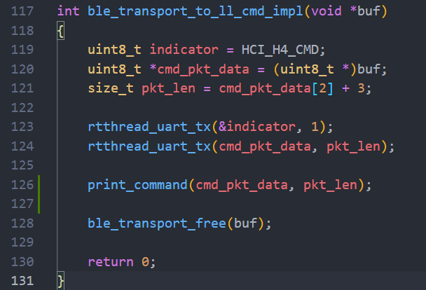
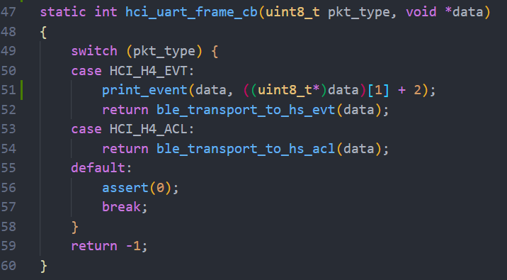
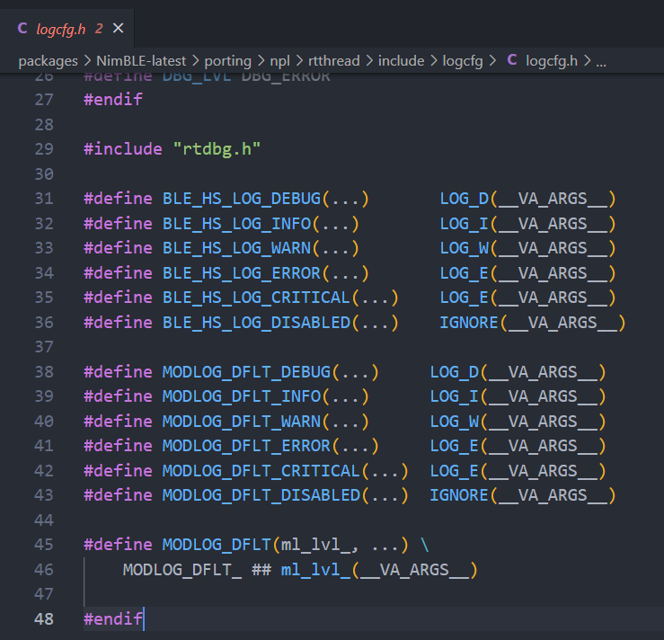
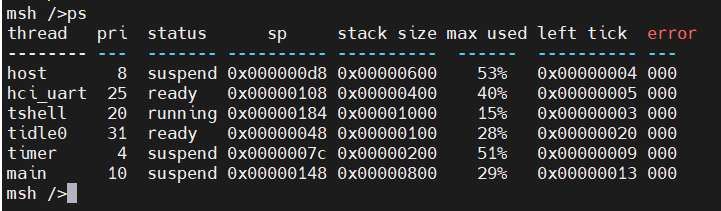
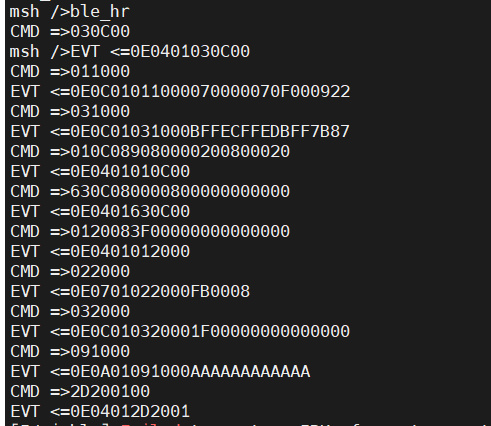
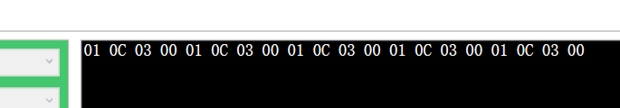
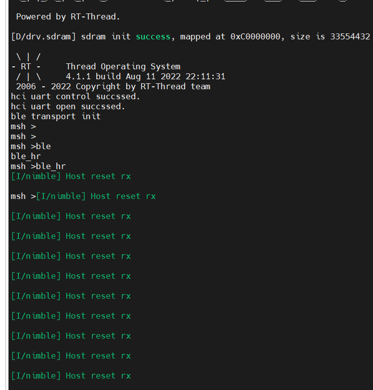
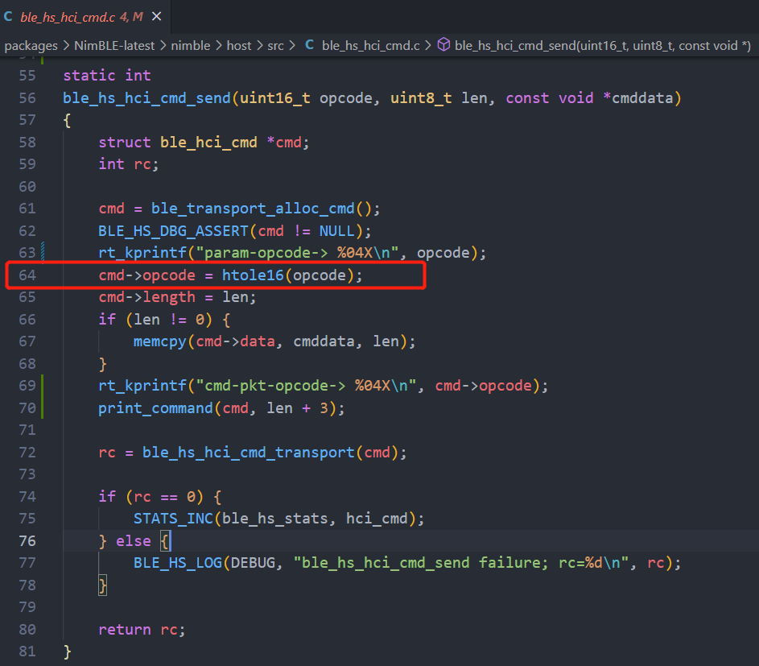
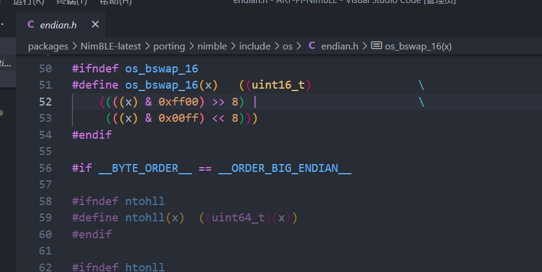

# NimBLE Debug 记录文档

之前在 Ubuntu 的 qemu 上面搭配 Nordic 运行 NimBLE 的过程中遇到的问题比较少，直到前段时间在实际板子上运行时，有可能的各种问题就暴露出来了，这里记录一下 Debug 过程。

## 两个分析点

1、NimBLE Host 的 运行主要以之前小伙伴做过的 RT-Thread 相关 OS 接口移植为基础，如果 Host 本身运行出问题的话，基本上 RT-Thread 就会输出一些相关信息了。 这里比较好容易观察到。

2、还有一部分主要是在 Host 和 Controller 之间的 HCI 通信问题，这里的问题比较隐秘，基本上不会出现什么报错信息，只是说运行后没有什么反应。

## 工具代码 - HCI 传输包打印

按照我们预先期望的组合形式，主要是使用 RT-Thread 上面跑 Host 层，而外部蓝牙控制器跑 Controller 层，使用串口进行连接。

必然会涉及到 HCI 层中 双向数据包的传输，之前的工作完成了 HCI 层对接 RT-Thread UART。 因此 HCI 包在 串口上的传输过程我们还是很清楚的。通常用下面两个函数去打印包的一些相关信息。主要使用到 rt-thread 的内核打印函数 `rt_kprintf` 。

-   HCI command PKT

```c
static void print_command(uint8_t *buf, uint16_t len)
{
    rt_kprintf("CMD =>");
    for (uint16_t i = 0; i < len; i++) {
        rt_kprintf("%02X", buf[i]);
    }
    rt_kprintf("\n");
}
```

-   HCI event PKT

```c
static void print_event(uint8_t *buf, uint16_t len)
{
    rt_kprintf("EVT <=");
    for (uint16_t i = 0; i < len; i++) {
        rt_kprintf("%02X", buf[i]);
    }
    rt_kprintf("\n");
}
```


一般上述两个 debug 工具函数定义及使用 在 `NimBLE-latest\nimble\transport\rtthread\src\ble_hci_rtthread_uart.c` 文件中，这个文件主要是负责 HCI 层到 UART 的对接，包括使用 UART 发送和接收都在这。

首先找到 CMD PKT 发送的接口，插入 `print_command` 函数（图中 127 行 ）：



因为这里 `rtthread_uart_tx()` 主要是用 串口发送 数据的接口，如果数据无法发送完，则会在其中无法执行完毕，因此把 `print_comand()` 加在这里也是初步默认发送完毕，然后打印一下发出去的 CMD PKT 数据。


然后找到 接收 EVT PKT 处理的地方，插入 `print_event` 函数（下图中51行）：



这里是一个帧处理的回调函数，在从串口收到的数据可以组成一个 EVT 格式的 PKT 时候，就会自动回调此函数，这里注意下第2个参数，长度主要是由数据包中 第2个字节 + 2 得来。

插入上述两个 HCI PKT 打印函数后， 正常运行NimBLE时基本上都能看到双向传输的 HCI 数据包信息，能有个初步的判断。


## 工具代码 - 日志接口 

已经移植好了相关日志接口， 这里面出现的 Log 接口都能直接用，加在对应的位置就好了。



## Debug 过程

1、先看一下 Host 以及 HCI 的线程是否正常：

运行例程后，直接用 `ps` 命令看一下后台线程：



看一下有没有错误码，有没有异常的线程，这里 host 和 hci_uart 线程都算正常。


2、从 HCI 传输下手：

其实我的debug 过程基本都是先从上一章节的两个打印函数入手的，首先观察一下 HCI 的双向传输是否正常。

正常情况下应该和下图类似， Host 发送 CMD 包后 ， Controller 会返回 EVT 包来响应。



这里第一条CMD尤其重要，这是 一条复位命令，一般都是 `03 0C 00` ，且 Controller 会返回 EVT 包为 `0E 04 01 03 0C 00`

如果 HCI 包双向传输有问题，可以考虑下面情况：

1.  串口是否配置好，能否正常使用？

    针对这个问题，还是最好接一个 USB转串口的工具，看一下串口里面传输的数据。适当测试一下串口的收发功能是否正常。

2.  如果 CMD 发送是正常的，但是没有收到 EVT 包，是不是CMD数据有问题？

    第一种情况，看一下 CDM 数据是不是有问题，可以按照上面提到的第一条复位命令作为参考，正常的包 应该是  `03 0C 00` 然后Controller 会返回响应的 EVT ，也对比下是不是有问题。

3.  检查一下 Controller 芯片是否正常工作？

    针对 Controller 芯片工作不正常的情况，建议还是使用软件包里 firmwares 目录下的文档说明，重新弄一下板子和固件，一般不会有问题。


## 实际遇到过的问题

### Keil 环境下 NimBLE 源码中大小端判断失效

**时间：** 7.28 - 8.14， 中间有段时间没有管这个问题

**现象：**自 NimBLE 开始上板子测试以来，在 Studio 的工程下，运行基本正常，但是在 BSP 工程下，总是没有反应。

**debug 过程：**

1、首先看了一下 Host 和 Hci_uart 线程，都没啥运行问题。

2、查看串口的收发功能，经过检查，发送和接收都是正常的（使用 USB 转 TTL 芯片）。

3、观察 HCI 双向传输情况：

首先我看了一下 CMD PKT 的发送情况，接上串口芯片打开终端看了一下：

 

应该是一直在发复位信号，一个 indicator `01` + 复位命令 `03 0C 00`, 这里已经明显看出来不对了， 发的是 `0C 03 00`

那首先发送 CMD 就有问题了，并且是发送复位信号这里，找到 Host 层代码相关的地方，添加了两条日志打印：


果然在实际运行中，发现 Host 一直卡在 reset controller 的流程



之前**没有任何日志输出**也是因为 Host 一直在这里**尝试复位** Controller , 其他代码位置应该需要 Host 完全运行起来才能输出相关的日志。

顺藤摸瓜往下找发送 CMD 的数据包数据，在 **ble_hs_hci_cmd.c** 源码文件中找到了下图中的函数接口，并且发现了 其对 CMD 包中的 opcode 进行了一个大小端匹配转换：



对 opcode 操作前后进行打印，果然发现 opcode 被改变了，与此同时我也在 studio 工程上进行了一样修改，发现 opcode 并没有被改变！所以这里 `htole16()` 一定是有问题了。

htole16 定义在 `endian.h`  头文件中，并且以下面的 宏定义判断大小端：



然后我们估计将 大端区段代码 里的 htole16() 定义故意改错，重新编译工程就出现了错误，因此可以确定 htole16 是用大端里的 定义去替换了，而不是小端。这样的话，不止 Host 的发送 CMD过程，估计 EVT 的接收解析过程也会收到影响。

这里就定位到了问题：

查了一下 keil 下面并没有 BYTE_ORDER 和 ORDER_BIG_ENDIAN 这样的大小端宏定义，而gcc下有，这也就解释了为什么 Studio 的工程正常，而Keil 工程不正常。并且有人出现了同样的问题：https://github.com/alibaba/AliOS-Things/issues/903

这里由于出现了两个未定义的宏定义，可能默认等于同一个值，那这样上述的判断就成立了，所以被替换成了大端里的 htole16 宏定义

4、解决问题：

通过修改 Sconscript 文件，在生成 keil 工程的时候，为其添加 上述相关大小端的定义：

```
if rtconfig.CROSS_TOOL == 'keil':
    LOCAL_CCFLAGS += ' --gnu --diag_suppress=111'
# __BYTE_ORDER__ & __ORDER_BIG_ENDIAN__ & __ORDER_LITTLE_ENDIAN__ is not defined in keil
    CPPDEFINES.append('__ORDER_LITTLE_ENDIAN__=1234')
    CPPDEFINES.append('__ORDER_BIG_ENDIAN__=4321')
    CPPDEFINES.append('__BYTE_ORDER__=1234')
```


### 此文档随时更新......