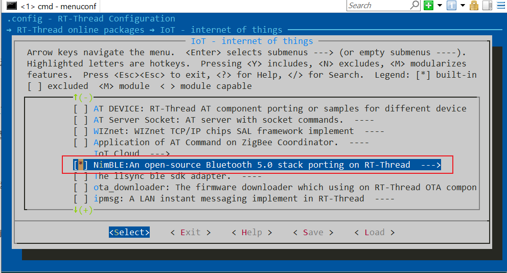
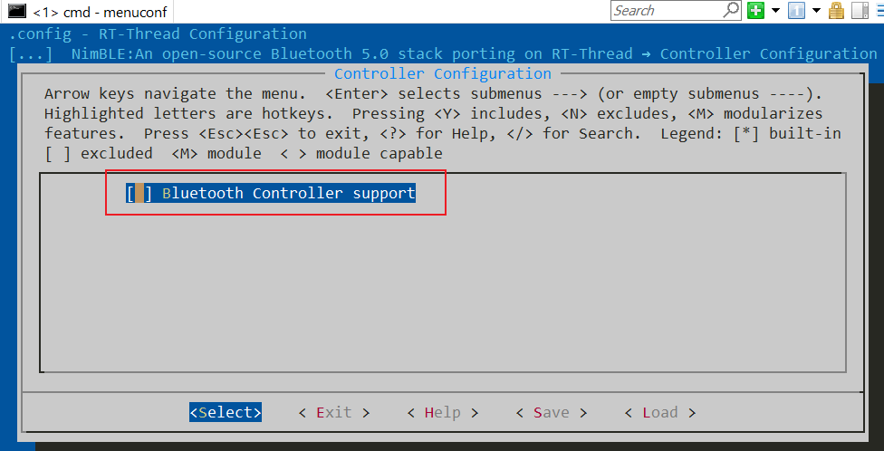
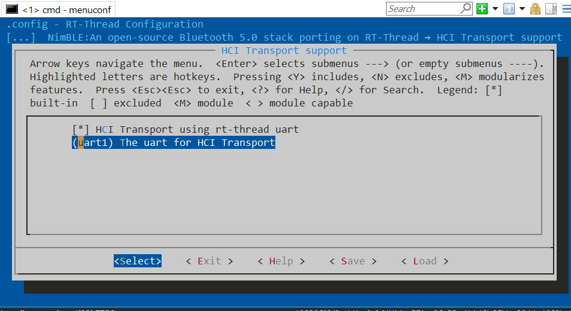
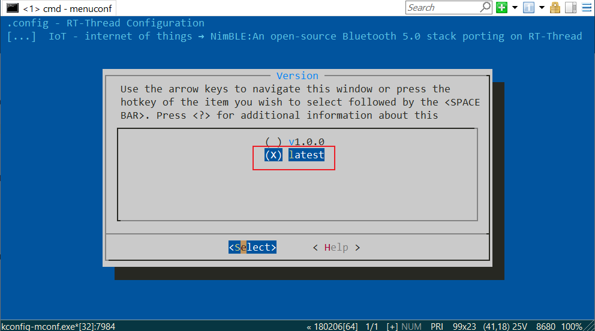
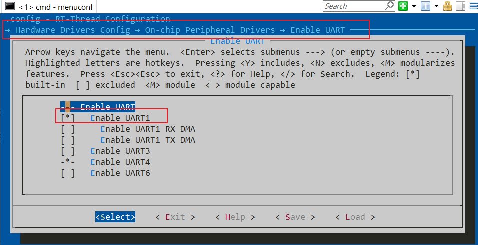
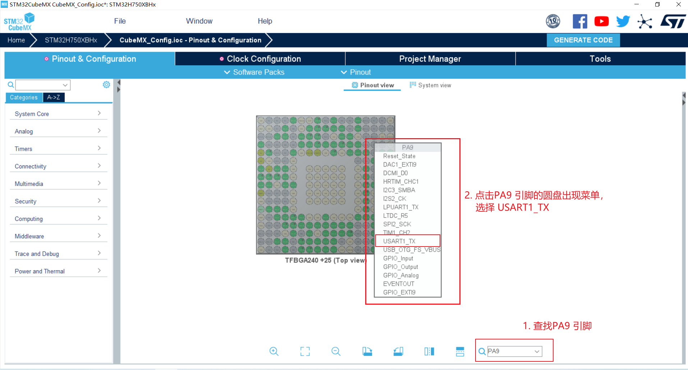
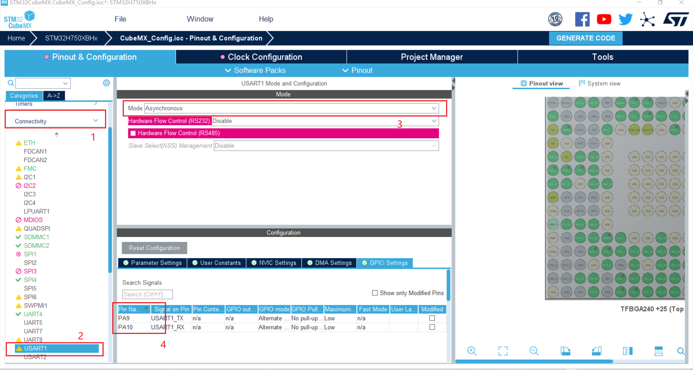
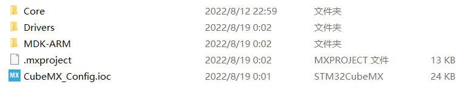
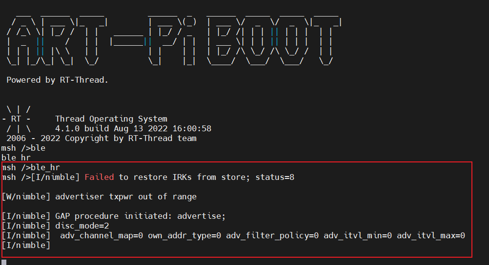
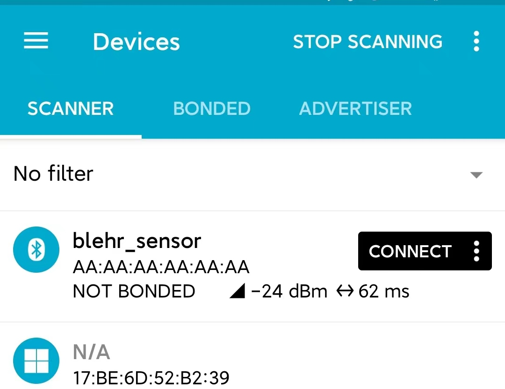

# 如何在 ART-Pi 的 bsp 工程中使用 NimBLE 蓝牙协议栈

本文主要介绍 NimBLE 软件包的在 ART-Pi bsp 工程下的使用

-   目前 NimBLE 支持 BLE Host 层，同时 bsp 工程下暂不支持使用 ART-Pi 板载的 AP6212 蓝牙芯片，所以需要外接蓝牙其他的蓝牙 Control 芯片，如下文中提及的 Nordic 系列芯片

-   如需要使用 ART-Pi 板载 AP6212 ， 可以移步-> “如何在 ART-Pi studio 工程下使用 NimBLE 蓝牙协议栈”

## 配置使用 NimBLE

在 stm32h750-artpi 工程目录中打开 `env` 工具， 输入 `menuconfig` 进行配置

1、进入 RT-Thread online packages → IoT - internet of things 目录即可看到 NimBLE 软件包，勾选软件包



2、进入 Controller Configuration **关闭** NimBLE Controller 支持



在 RT-Thread 上 NimBLE 不需要运行 Controller ，使用 蓝牙 Control 芯片代替。

3、配置 NimBLE HCI 层支持，选择实际用于连接蓝牙 Control 芯片的串口，设置为 “uart1”。



4、选择使用相应的蓝牙例程：在 **Bluetooth Samples** 中选择相应的例程。


目前支持以下几个例程：

-   BLE peripheral heartrate sensor
-   BLE peripheral cycling speed and cadence sensor
-   BLE central role sample
-   BLE peripheral role sample
-   BLE beacon sample
-   BLE advertiser sample

5、选择最新版本代码： 在 **Version** 中选择 “latest”。



配置完成后保存。

## 配置串口

当前 stm32h750-artpi 工程 下默认支持的串口有 UART3 和 UART4，但这里需要使用扩展引脚中的 UART1 来外接 蓝牙 Control 芯片。

1、在 menuconfig 中打开 UART1 的使能



保存退出。

2、打开 `stm32h750-artpi\board\CubeMX_Config\` 路径下的 STM32CubeMX 配置文件（此步骤需要安装STM32CubeMX软件）。


3、按照下图配置好 USART1_TX - PA9 和 USART1_RX - PA10  ，注意两个引脚都是一样的步骤。



PA10 则配置成 USART1_RX。

3、配置完两个引脚后，按照下图顺序找到并使能 USART1



可以看到标号 4 处已经显示上一步骤设置的 TX 和 RX 引脚。

4、点击右上角的 "GENERATE CODE" 按钮，应该会出现 “时钟不对” 相关的警告，点击确定。等待代码生成完毕后，目录下应该会变成这样



5、由于当前版本工程默认使用 串口驱动v2 版本，因此还需要在 `stm32h750-artpi\board\board.h` 头文件相应位置添加 UART1的 BUFFER 大小配置

```c
#define BSP_UART1_RX_BUFSIZE   256
#define BSP_UART1_TX_BUFSIZE   256
```

感兴趣的伙伴可以看一下官方文档：[UART设备v2](https://www.rt-thread.org/document/site/#/rt-thread-version/rt-thread-standard/programming-manual/device/uart/uart_v2/uart)

## 编译运行

1、在 stm32h750-artpi 工程目录中打开 `env` 工具

2、使用 `pkgs --update` 命令更新 NimBLE 软件包

```shell
$ pkgs --update
```

3、使用 `scons  --target=mdk5` 命令生成对应的 keil 工程， 并双目录下的 **project.uvprojx** 文件打开 keil 工程。

4、编译 keil 工程

**注意：** 如果编译过程中遇到下图中类似问题：


需要在 stm32h7xx_hal_msp.c 文件中把 `PeriphClkInitStruct` 变量相关的代码语句都删除，包括声明、定义语句等。

5、将程序下载到 ART-Pi 上

**注意：** 如果下载遇到问题，可以看一下是不是没有添加外部下载算法，参考 [ART-Pi 官方文档](https://github.com/RT-Thread-Studio/sdk-bsp-stm32h750-realthread-artpi/blob/master/documents/UM5005-RT-Thread%20ART-Pi%20%E5%B8%B8%E8%A7%81%E9%97%AE%E9%A2%98%E8%A7%A3%E7%AD%94.md)

6、串口连接蓝牙 Control 芯片。关于蓝牙控制器选择可以参考 [蓝牙控制器固件](https://github.com/RT-Thread-packages/nimble/tree/master/docs/firmwares) （或 NimBLE 软件包目录下 /docs/firmwares/README.md）。

7、连接串口终端，可以使用 `hlep` 看到 BLE 相关例程命令，运行即可，可以看到相关日志输出



使用 **nRF Connect** 手机 APP 即可成功观察到蓝牙设备，名称为 **blehr_sensor** ：




 点击连接后，在 CLIENT 下即可看到 Heart Rate 相关数据。


