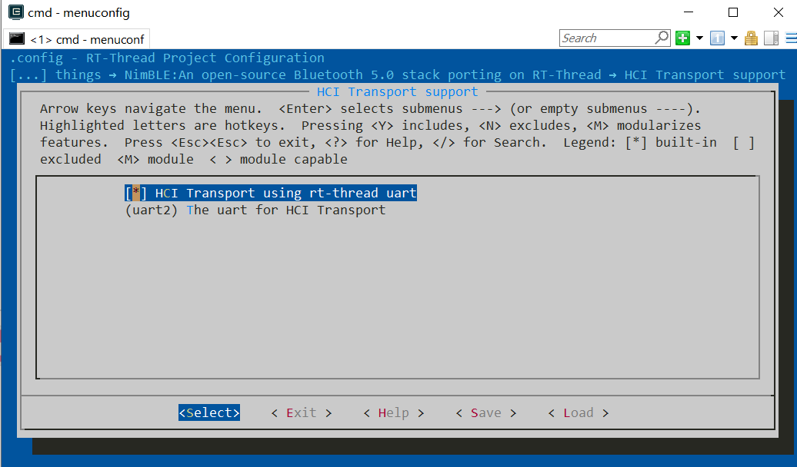

# 如何在 RT-Thread Smart 下使用 NimBLE 蓝牙协议栈

本文主要介绍 NimBLE 软件包的在 RT-Thread Smart 下的使用

-   目前官方使用 ART-Pi-Smart 评估板运行 RT-Thread Smart，此工程也是跑在 ART-Pi-Smart 开发板上。 
-   需要使用 ART-Pi-Smart 搭配 外部蓝牙 Controller 芯片使用。
-   需要配置好 rt-thread smart 在 Windows 下的开发环境。

## 准备 RT-Thread Smart 开发环境

主要按照 [ART-Pi-Smart 官方用户手册](https://gitee.com/cazure/ART-Pi-smart/blob/master/documents/user_manual/README.md#%E6%A6%82%E8%BF%B0)进行开发环境的搭建：

1、通过 [ART-Pi-Smart SDK 仓库](https://gitee.com/rtthread/ART-Pi-smart) （Gitee）下载最新的 ART-Pi Smart SDK 软件包。

2、通过[用户手册中相关章节](https://gitee.com/cazure/ART-Pi-smart/blob/master/documents/user_manual/README.md#art-pi-smart-sdk-%E8%BD%AF%E4%BB%B6%E5%8C%85%E8%B5%84%E6%BA%90)下载一下 Windows 版本的 arm-linux-musleabi 工具链，将解压出来的 `arm-linux-musleabi_for_i686-w64-mingw32` 文件夹整个拷贝到 ./tools/gnu_gcc/ 下面，如图：


3、装一下 env 开发工具，这个不多说。

4、加载工具链，在 ART-Pi-Smart SDK 根目录下打开 env 工具，依次运行命令：

-   `smart-env.bat`  - 设置当前环境变量
-   `set RTT` - 查看环境变量信息，检查交叉编译器路径是否成功添加
-   `arm-linux-musleabi-gcc -v` - 检查交叉编译器是否生效

结果应该显示如下：


**注意： 每一次重新打开 env 工具都需要通过运行 ART-Pi-Smart SDK 根目录下的 smart-env.bat 来设置当前环境变量，添加交叉编译器路径，否则编译会出错。**

5、依据 [USB方式启动 rt-smart 内核](https://gitee.com/cazure/ART-Pi-smart/blob/master/documents/user_manual/README.md#%E6%96%B9%E6%B3%95%E4%BA%8C%E9%80%9A%E8%BF%87-usb-%E6%96%B9%E5%BC%8F%E5%90%AF%E5%8A%A8-rt-smart-%E5%86%85%E6%A0%B8%E5%9F%BA%E4%BA%8E-windows-%E7%8E%AF%E5%A2%83) 章节，下载 100ask_imx6ull 烧写工具（由百问网提供）。

## 配置相关串口

需要使用串口来连接外部的蓝牙 Controller 芯片，这里我们使用 “uart3” 

1、在设置好环境的 env 工具下进入 `kernel\bsp\imx6ull-artpi-smart\` 路径，这个路径下工程就是为 ART-Pi-Smart 做的 bsp 工程，也是 ART-Pi-Smart 上的rt-smart 内核工程。

2、运行 `menuconfig` 命令后，选择进入 Platform Driver Configuration → Select UART Driver 目录下进行 UART 设备的使能，这里使能 uart3 。


保存退出，接着下面章节配置 NimBLE。

## 在内核 bsp 下配置使用 NimBLE

env 工具还是进入 `kernel\bsp\imx6ull-artpi-smart\`  路径。

1、运行 `menuconfig` 命令后，进入 RT-Thread online packages → IoT - internet of things 目录即可看到 NimBLE 软件包，勾选软件包


2、将 NimBLE 下 Controller Configuration 里的配置关闭


在 RT-Thread Smart 上 NimBLE 不需要运行 Controller ，使用 蓝牙 Controller 芯片代替。

3、HCI Transport support 下配置 HCI uart 设备为 "uart2"（这里使用设备 uart2 正是对应之前 使能的 uart3，这里序号有出入和实际系统的设备管理有关，实际板上外设接口是 uart3 但是系统内核映射为 uart2 设备了）。



4、Bluetooth Samples 选择 “BLE peripheral heartrate sensor” ； Version 选择 “latest”。最后如下图所示：


目前支持以下几个例程：

-   BLE peripheral heartrate sensor
-   BLE peripheral cycling speed and cadence sensor
-   BLE central role sample
-   BLE peripheral role sample
-   BLE beacon sample
-   BLE advertiser sample

配置完成后保存。

## 编译 & 连接外部蓝牙芯片

1、在前面的 menuconfig 配置完成后，使用 `pkgs --update` 命令更新 NimBLE 软件包

```shell
$ pkgs --update
```

2、运行 `scons -c` 清除之前的构建后，运行 `scons` 命令进行内核代码的编译。

3、编译成功后，  `kernel\bsp\imx6ull-artpi-smart\`  路径下会生成 rtthread.imx 文件。


4、把外部的蓝牙 Control 芯片连接好，注意 UART 的引脚，这里使用 nrf52840dk 连接 ART-Pi-Smart 的 UART3。务必在后面内核烧写的步骤**前**连接好 Control 芯片。关于蓝牙控制器选择可以参考 [蓝牙控制器固件](https://github.com/RT-Thread-packages/nimble/tree/master/docs/firmwares) （或 NimBLE 软件包目录下 /docs/firmwares/README.md）。


## 烧写内核 & 运行 NimBLE

windows 下烧写内核的过程，按照文档的相关章节（[USB方式启动 rt-smart 内核](https://gitee.com/cazure/ART-Pi-smart/blob/master/documents/user_manual/README.md#方法二通过-usb-方式启动-rt-smart-内核基于-windows-环境)）；连好两根线后，应该可以用终端软件打开其中一根串口线。

1、配置 ART-Pi Smart 开发板进入到 USB 固件下载模式
      操作方法：开发板上电之后，先按下 "BOOT 启动按键" 不松开，然后，再按下 “RST 复位键”，即可切换到 USB 固件下载模式

2、打开之前下载好的烧录工具 100ask_imx6ull_flashing_tool.exe，显示设备已连接即可。（显示未连接则重复 1 中的操作）

3、选择“专业版”，点击第一排“固件/裸机”按钮，选择刚刚编译出来的 rtthread.imx 文件（这里要注意绝对路径里面不要包含中文和空格）。然后点击 “运行” 按钮即可，等待内核下载完毕。如下图显示：


4、内核烧写完成后，**不要**按复位按钮，这时候观察终端，可以发现系统内核已经跑起来了（如下图）。

**注意：如果按了复位按钮，bootloader 则会默认加载固化在 emmc 中的出厂内核镜像，就不是我们自己编译的了**


5、在系统命令行 输入 `ble_hr` 命令，即可运行刚刚配置编译进内核的 NimBLE 软件包例程。


6、 使用 **nRF Connect** 手机 APP 即可成功观察到蓝牙设备，名称为 **blehr_sensor** ：


 点击连接后，在 CLIENT 下即可看到 Heart Rate 相关数据。


## 需要注意的地方

1、之前系统中 uart 设备编号与芯片 uart 接口编号不一致的问题：

`menuconfig` 中的uart配置 和 实际系统中 uart 对象名是不匹配的。 实际使用时，系统中的 uart 序号应该减一。即 **menuconfig** 中的 uart1 对应 实际系统中的 uart0， **menuconfig** 中的 uart2 对应 实际系统中的 uart1。

2、一定要在 USB 烧写内核步骤之前连接好外部的蓝牙 Controller 芯片，否则烧写完成后自动加载内核会出现断言错误，因为对应串口没接好。这时如果使用复位按钮来重新加载内核，又会自动加载 emmc 中固化的出厂内核，就不是我们包含 NimBLE 的内核了。

3、针对 USB 烧写内核只能加载一次的问题，应该可以使用之前的烧写工具，将重新编译的内核固化到 emmc 中，这样就不用每次都重新烧写了。